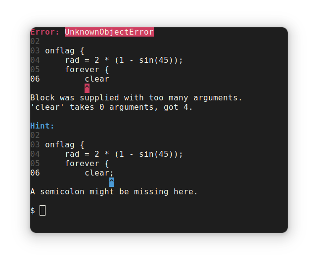

# Bitter for GoboScript
**Bitter is a work-in-progress! Nothing is complete and the code is not satisfactory yet.**  
  
Bitter is my custom built compiler for [GoboScript](https://github.com/aspizu/goboscript). My goals with this project are the following:

- Maintain one-way compatability with GoboScript+GSC projects.
- Supply better error messages.
  - Use modern terminal formatting.
  - Tell the user how a problem should be solved.
  - Ensure errors can be understood at a glance.
- Support more file formats for asset imports.
- Support sounds.
- Provide an API for writing Python extensions for compile-time features.
- Provide more language features.
  - Constructors, functions which are constructed from a 'frame', which could adapt to different source variables.
  - Reporter functions with return values.
  - Structs for better list value referencing and initialisation.
  - Inline functions.

I have a lot of respect for the original gsc project. The reason I am branching off feature-wise is because the maintainer has stated that he wants to maintain compatibility with sb3, id est, no syntax sugar. The maintainer has also stated that he does not maintain the project fully anymore. Since I like the idea of the language, I decided that the best way forward would be to make my own compiler. This is also a learning project. I am new with Python and the source code is terrible.